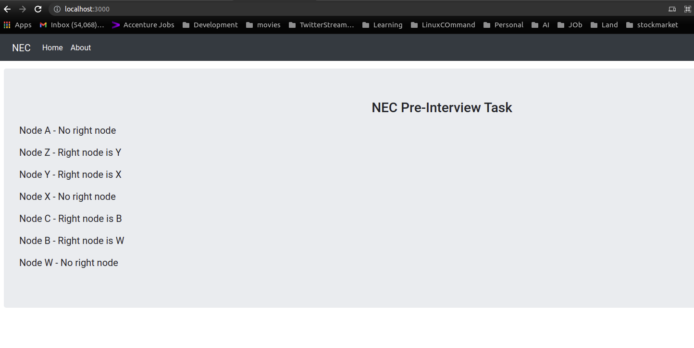
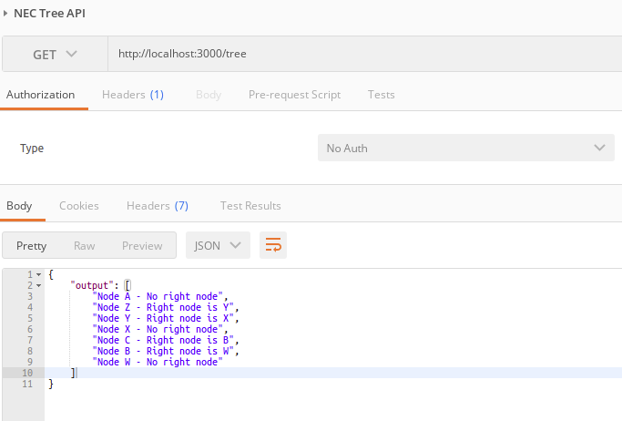

### NEC Task

NEC Pre-Interview Task to print all the node id’s and their corresponding right node id.

#### Prerequisites:

- node v14.15.4

#### Source Code:
- Main Business Logic at <a href="app/utils/tree.js">Util File For Tree Builder</a>
- Other Code Reference <a href="app/routes/nec">Routes</a>, <a href="app/controllers/nec">Controller</a>, <a href="app/views/nec.views/tree.ejs">Views</a>
- Input file <a href="app/media/nic_tree_input.txt">nic_tree_input.txt</a>

#### How to Run:

- install all modules first by typing `npm install` or `yarn add`

- to run it please type `npm run start` or `yarn run start` and access http://localhost:3000/ or http://localhost:3000/tree

#### Endpoint Route:


| Name              | Endpoint Route                    | API Method |
| ----------------- | --------------------------------- | ---------- |
| Access GUI    | http://localhost:3000     | - |
| Access API    | http://localhost:3000/tree      | GET |


 - For API Postman Collection Located At **./doc/NEC.postman_collection.json**


<a href="doc/NEC.postman_collection.json"> Click here for API Postman Collection</a>

## ✨ Output

Output in GUI using http://localhost:3000



Output in API Postman using http://localhost:3000/tree



#### Core Route

```javascript
class Route {
  init() {
    return [
      //init home route
      new HomeRoute().route(),
      new AboutRoute().route(),

      //NEC
      new TreeRoute().route(),
      new TreeApiRoute().route(),
    ]
  }
}

module.exports = { Route }

```

#### Utils View To Refer Main Business Logic

```javascript
class Node
{
	constructor(item)
	{
		this.data = item;
		this.left = this.middle= this.right = this.nextRight = null;
	}
}
class Tree{
    constructor(inputData)
      {
          /*
          DESC: nodeBuilder used to build a tree format
          For Ex:
            this.root = new Node('A');
            this.root.left = new Node('Z');
            this.root.middle = new Node('Y');
            this.root.right = new Node('X');
            this.root.left.left = new Node('C');
            this.root.left.right = new Node('B');
            this.root.right.left = new Node('W');
          */
          this.arrFlat= null
          this.root= this.nodeBuilder(inputData)  
      }
      buildLeafHierarchy(inputData){
          //Generate layer level root node to manage hierrachy
          let input= inputData;
          let leafHierarchy={}
          let arrFlat=[...new Set(input.flat().flat())].filter(n=>n)
          this.arrFlat= arrFlat
          arrFlat.forEach(flat=>{
              input.forEach((val1, idx1)=>{
                  val1.forEach((val2, idx2)=>{
                      if(val2.includes(flat)){
                          if(leafHierarchy[val2[0]]==undefined) {
                              leafHierarchy[val2[0]]=[]
                              if(val2[1] && !leafHierarchy[val2[0]].includes(val2[1])){
                                  leafHierarchy[val2[0]].push(val2[1])
                              }
                          }
                          else{
                              if(!leafHierarchy[val2[0]].includes(val2[1])){
                                  leafHierarchy[val2[0]].push(val2[1])
                              }
                          }
                      }
                  })
              })
          })
          delete leafHierarchy.null
          return leafHierarchy
      }
      nodeBuilder(inputData){
          //Build Node tree based on hierrachy
          let leafHierarchy= this.buildLeafHierarchy(inputData)
          let finalNode=[], treeBuilder;
          for(var val in leafHierarchy){
              let leafNodes=leafHierarchy[val]
              let previousLayer;
              if(finalNode.length>0){
                  previousLayer= finalNode.shift()
                  for (var val1 in previousLayer){
                      if(["left","right", "middle"].includes(val1)){
                          let leafNode= previousLayer[val1]
                          if(leafNode && leafNode.data==val){
                              previousLayer[val1]= this.leafBinder(previousLayer[val1][val1], leafNodes, val)
                              treeBuilder=previousLayer
                          }
                      }
                  }
              }
              treeBuilder=this.leafBinder(treeBuilder, leafNodes, val)
              finalNode.push(treeBuilder)
              treeBuilder=null
          }
          return finalNode.shift()
      }
      leafBinder(element, leafNodes, val){
          if(element==null){
              element=new Node(val)
          }
          leafNodes.forEach((value)=>{
              if(element.left==null){
                  element.left=new Node(value)
              }
              else if(element.middle==null && leafNodes.length>2){
                  element.middle=new Node(value)
              }
              else if(element.right==null){
                  element.right=new Node(value)
              }
          })
          return element
      }
      connect(root)
      {
          //Function used to link each node with right siblings
          if (root == null)
              return;
          let tempArr = [];
          tempArr.push(root);
          let temp = null;
          while (tempArr.length!=0) {
              let n = tempArr.length;
              for (let i = 0; i < n; i++) {
                  let prev = temp;
                  temp = tempArr.shift();
                  if (i > 0)
                      prev.nextRight = temp;
  
                  if (temp.left != null)
                      tempArr.push(temp.left);
                  
                  if (temp.middle != null)
                      tempArr.push(temp.middle);
  
                  if (temp.right != null)
                      tempArr.push(temp.right);
              }
              temp.nextRight = null;
          }
          return root
      }	
  }

module.exports = { Tree }
```

#### App Controller

```javascript

class TreeController extends Model {
  constructor() {
    super()
    this.fileName= path.join(__dirname, '../../media/nic_tree_input.txt')// Reading textfile to extract input
    this.treeOutput= []
  }

  async controller(req, res, next) {
    //Async function to view in EJS
    return new Promise((resolve, reject) => {
      fs.readFile(this.fileName, 'utf8', (err, data) =>{              
        if (err) throw err;
        let inputData= []
        data.split(/\r?\n/).forEach(line=>{
            inputData.push(JSON.parse(line))
        })
        var tree = new treeNodes.Tree(inputData);
        let finalTree= tree.connect(tree.root);
        tree.arrFlat.forEach(node=>{
            this.printer(finalTree, node)
        });
        resolve(this.treeOutput);
      });      
    })
  }

  async controllerApi(req, res, next) {
    //API to return JSON
    fs.readFile(this.fileName, 'utf8', (err, data) =>{              
      if (err) throw err;
      let inputData= []
      data.split(/\r?\n/).forEach(line=>{
          inputData.push(JSON.parse(line))
      })
      var tree = new treeNodes.Tree(inputData); //Build tree
      let finalTree= tree.connect(tree.root);//Function used to link each node with right siblings
      tree.arrFlat.forEach(node=>{
          this.printer(finalTree, node)
      });
      res.send({ "output": this.treeOutput })      
    });    
  }

  printer(nodeInstance, node){
    //Function to find right node to print all the node id’s and their corresponding right node id. 
      if (nodeInstance.data==node){
          if(nodeInstance.nextRight==null){
              const msg= `Node ${node} - No right node`
              this.treeOutput.push(msg);
          }
          else if(nodeInstance.nextRight!=null){
              const msg= `Node ${node} - Right node is ${nodeInstance.nextRight.data}`
              this.treeOutput.push(msg);
          }
      }
      else if(nodeInstance.data!=node){
          if(nodeInstance.left!=null){
            this.printer(nodeInstance.left, node)
          }
          if(nodeInstance.middle!=null){
            this.printer(nodeInstance.middle, node)
          }
          if(nodeInstance.right!=null){
            this.printer(nodeInstance.right, node)
          }
      }
  }
}

module.exports = { TreeController }

```

#### App Route

```javascript
class TreeRoute extends Controller {
  constructor() {
    super()
    this.view = new View()
  }
  route() {
    const { view } = this
    return this.get('/', async(req, res) => {
      view.render(res, 'nec.views/tree', {
        output: await new TreeController().controller(req, res)
      })
    })
  }  
}

module.exports = { TreeRoute }

class TreeApiRoute extends Controller {
  constructor() {
    super()
    this.view = new View()
  }
  route() {
    return this.get('/tree', (req, res) => new TreeController().controllerApi(req, res))
  }  
}

module.exports = { TreeApiRoute }

```

#### App

```javascript
class App extends Route {
  init() {
    //init default route
    app.use(super.init())
    // listening server port
    http.createServer(app).listen(3000)   
    console.log('Server started running on port:', 3000);   
  }
}

// init application
new App().init()
```
**Thank you by Aswin**
